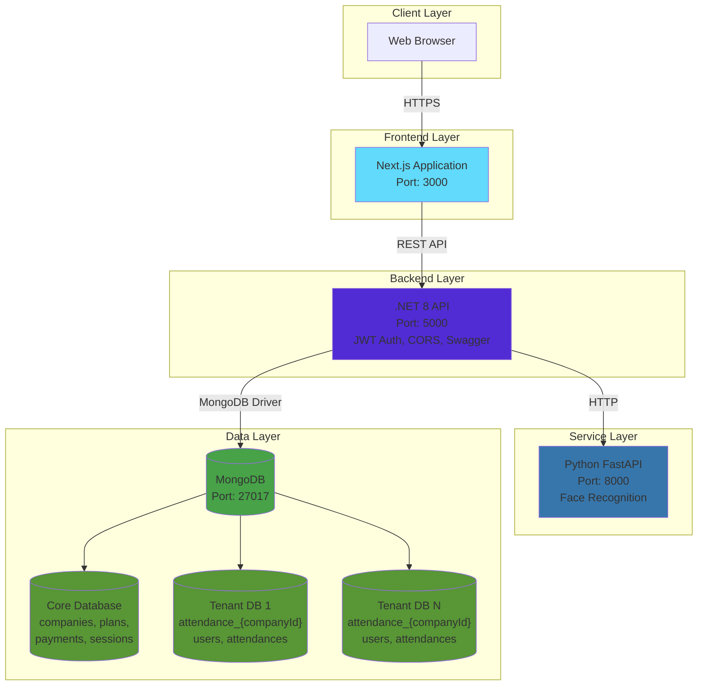
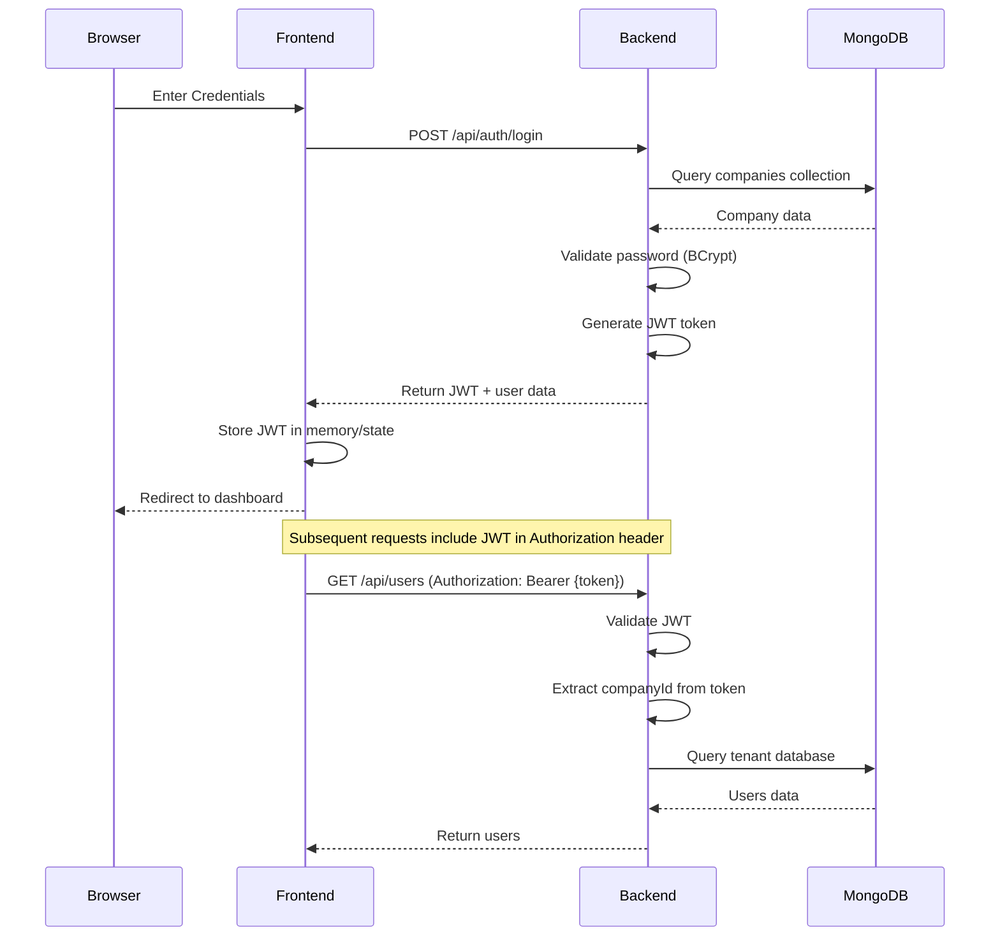
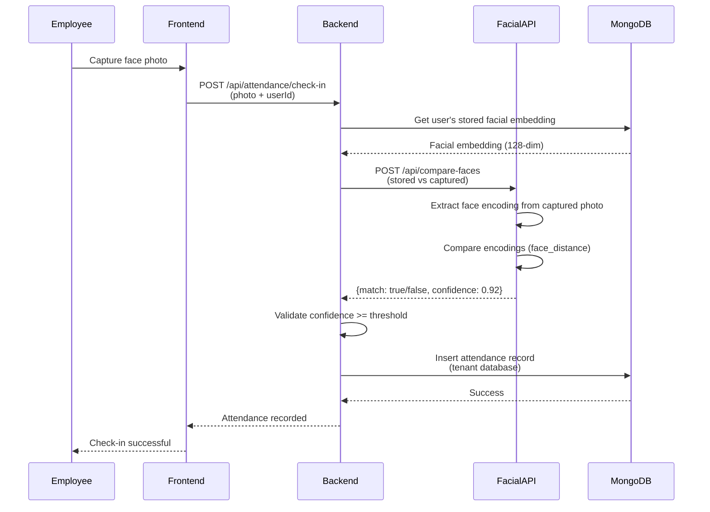

# System Architecture - Eyebek Attendance Control

## Overview

Eyebek is a microservices-based attendance control system designed for multi-company (multitenant) environments with facial recognition capabilities.

## System Design



## Communication Patterns

### 1. Frontend ↔ Backend
- **Protocol**: HTTPS/HTTP REST API
- **Authentication**: JWT Bearer tokens
- **CORS**: Configured in Backend to allow Frontend origin
- **Data Format**: JSON

### 2. Backend ↔ FacialAPI
- **Protocol**: HTTP (internal Docker network)
- **Service Discovery**: Docker DNS (`http://facialapi:8000`)
- **Purpose**: Facial recognition requests
- **Isolation**: FacialAPI has no database access

### 3. Backend ↔ MongoDB
- **Protocol**: MongoDB Wire Protocol
- **Driver**: MongoDB.Driver (C# .NET)
- **Connection**: Single client, multiple databases
- **Tenant Resolution**: Dynamic database selection based on `companyId`

## Data Architecture

### Core Database Schema

**Database**: `core`

```
companies
├── _id (ObjectId)
├── name
├── email (unique)
├── phone
├── address
├── passwordHash
├── status (enum: Active, Inactive, Suspended)
├── planId (reference to plans)
├── planStartDate
├── planEndDate
├── currentUsers
├── createdAt
└── updatedAt

plans
├── _id (ObjectId)
├── category (Basic, Pro, Enterprise)
├── price
├── duration (days)
├── description
├── userCapacity
├── features
├── active
├── createdAt
└── updatedAt

payments
├── _id (ObjectId)
├── companyId (reference)
├── planId (reference)
├── amount
├── paymentMethod (enum)
├── paymentStatus (enum)
├── paymentReference
├── receipt
├── paymentDate
└── createdAt

sessions
├── _id (ObjectId)
├── companyId (reference)
├── token (JWT)
├── ipAddress
├── userAgent
├── startDate
├── expirationDate
├── active
└── createdAt
```

### Tenant Database Schema

**Database Pattern**: `attendance_{companyId}`

```
users
├── _id (ObjectId)
├── companyId (tenant identifier)
├── name
├── email
├── passwordHash
├── document
├── role (enum: Admin, Manager, Employee)
├── status (enum: Active, Inactive, Suspended)
├── phone
├── photo
├── facialEmbedding (128-dim array)
├── createdAt
└── updatedAt

attendances
├── _id (ObjectId)
├── userId (reference to users)
├── timestamp
├── type (enum: CheckIn, CheckOut)
├── method (enum: Facial, Manual, QR)
├── confidence (for facial recognition)
├── capturePhoto
├── latitude
├── longitude
├── status (enum: Approved, Pending, Rejected)
└── createdAt
```

## Service Responsibilities

### Frontend (Next.js)
- **Role**: User interface and client-side logic
- **Responsibilities**:
  - Render UI components
  - Handle user interactions
  - Manage client-side state
  - Call Backend API
  - Display attendance data
- **Technologies**: Next.js 16, TypeScript, TailwindCSS

### Backend (.NET 8)
- **Role**: Business logic orchestrator and API gateway
- **Responsibilities**:
  - Authentication (JWT)
  - Authorization (role-based)
  - Business logic validation
  - MongoDB data access (core + tenant databases)
  - Orchestrate facial recognition requests
  - API endpoints (REST)
  - Tenant resolution
- **Technologies**: .NET 8, MongoDB.Driver, JWT, Swagger
- **Architecture Pattern**: Clean Architecture (Domain, Application, Infrastructure, API)

### FacialAPI (Python + FastAPI)
- **Role**: Facial recognition microservice
- **Responsibilities**:
  - Face detection
  - Face encoding extraction (128-dimensional vectors)
  - Face comparison
  - Return confidence scores
- **Technologies**: Python 3.11, FastAPI, face_recognition, dlib
- **Isolation**: No database access, stateless service

### MongoDB
- **Role**: Data persistence layer
- **Responsibilities**:
  - Store core business data
  - Store tenant-specific data in separate databases
  - Provide ACID transactions
  - Handle queries and indexes
- **Multitenant Strategy**: Database-per-tenant

## Authentication Flow



## Facial Recognition Flow



## Tenant Resolution Strategy

The Backend implements dynamic tenant resolution using the `companyId`:

1. **Authentication**: JWT token includes `companyId` claim
2. **Request Processing**: Extract `companyId` from JWT
3. **Database Selection**: Connect to `attendance_{companyId}` database
4. **Data Isolation**: Each company's data is physically separated
5. **Scaling**: Easy to move tenant databases to separate instances

## Deployment Considerations

### Development
- Use `docker-compose.yml` for local development
- Single MongoDB instance
- Services communicate via Docker network
- Hot reload enabled for Frontend and FacialAPI

### Production Recommendations

1. **Kubernetes Deployment**
   - Deploy each service as a separate deployment
   - Use Horizontal Pod Autoscaler (HPA) for Backend and FacialAPI
   - Configure Ingress for HTTPS termination

2. **MongoDB Production Setup**
   - MongoDB Atlas or self-hosted replica set
   - Enable authentication
   - Configure backup strategy
   - Consider sharding for large-scale deployments

3. **Load Balancing**
   - Nginx or cloud load balancer for Backend
   - Session affinity not required (stateless JWT)

4. **Caching**
   - Redis for session management
   - Cache frequently accessed data (plans, company settings)

5. **monitoring & Logging**
   - Prometheus + Grafana for metrics
   - ELK Stack or Loki for centralized logging
   - Distributed tracing with Jaeger/OpenTelemetry

6. **Security**
   - HTTPS everywhere
   - Rotate JWT secrets regularly
   - Enable MongoDB authentication and encryption at rest
   - Scan Docker images for vulnerabilities
   - Implement rate limiting

## Security Architecture

### Defense in Depth

1. **Network Layer**
   - Docker network isolation
   - Firewall rules
   - VPN/Private network for production

2. **Application Layer**
   - JWT authentication
   - Role-based authorization
   - Input validation and sanitization
   - SQL injection prevention (N/A for MongoDB, but NoSQL injection prevention)

3. **Data Layer**
   - Encrypted connections (TLS)
   - Encrypted data at rest
   - Regular backups
   - Access control

### Data Privacy

- **Facial Embeddings**: Store only mathematical representations, not raw images
- **Personal Data**: Comply with GDPR/local privacy laws
- **Tenant Isolation**: Absolute data separation between companies
- **Audit Logs**: Track all sensitive operations

## Scaling Strategies

### Horizontal Scaling

**Backend (.NET)**:
- Stateless design allows multiple instances
- Load balance with round-robin or least connections
- Scale based on CPU/memory metrics

**FacialAPI (Python)**:
- Compute-intensive facial recognition
- Scale to handle concurrent requests
- Consider GPU instances for better performance

**Frontend (Next.js)**:
- Static assets served via CDN
- SSR instances can scale horizontally
- Edge deployment for global performance

### Vertical Scaling

**MongoDB**:
- Increase instance size for better I/O performance
- Consider read replicas for read-heavy workloads

## Technology Choices Rationale

| Technology | Reason |
|------------|--------|
| **.NET 8** | Performance, modern C#, cross-platform, strong ecosystem |
| **MongoDB** | Flexible schema, multitenant support, horizontal scaling |
| **Next.js** | React framework, SSR/SSG, great DX, TypeScript support |
| **FastAPI** | Fast Python framework, auto API docs, async support |
| **Docker** | Consistent environments, easy deployment, microservices support |
| **JWT** | Stateless auth, scalable, industry standard |

---

**Architecture Design Principles**:
- Separation of Concerns
- Single Responsibility
- Dependency Inversion
- Fail Fast
- Design for Failure
- Stateless Services
- API-First Design
